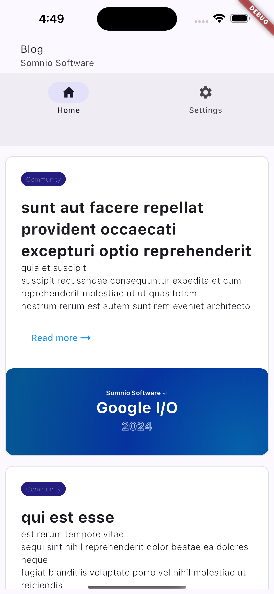
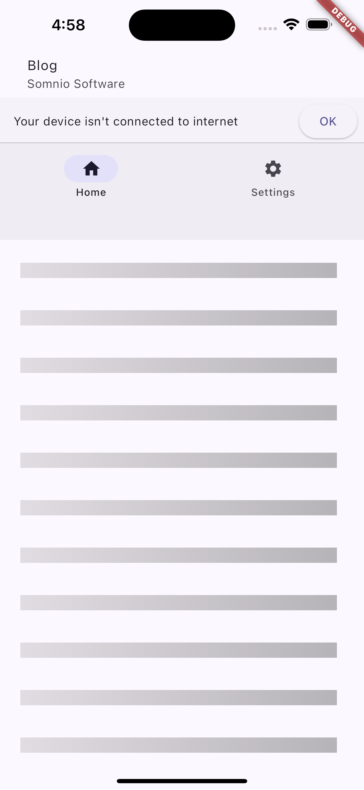

# About the project

This app consumes the [jsonplaceholder.typicode.com](https://jsonplaceholder.typicode.com/posts)
API, it uses BLoC to show a list of Posts, when the post
list is succesfully retrieved,
[BlocBuilder](https://github.com/mfs-luisortiz/jsonplaceholder-flutter/blob/f767688d8a989e42181136ac758475ed817098f4/lib/src/ui/screens/home_screen.dart#L65)
is used to update the ListView, this ListView only is updated when there's new data for the post list:

It also shows when an error happens like a conecction
error using a
[BlocListener](https://github.com/mfs-luisortiz/jsonplaceholder-flutter/blob/f767688d8a989e42181136ac758475ed817098f4/lib/main.dart#L29)
that allows us to show a
Banner, the Banner is only shown when a new error state is produced:

Unit testing is made with
[Mockito](https://pub.dev/packages/mockito)
to fake `http.Client` which allows to test the
[PostApiRepository](./lib/src/data/sources.dart).
